# 📄 System Documentation   
   
Mini_Banking is a banking simulation model that handles security-related functions such as Authentication, Authorization, Session management, Transaction processing, and Security telemetry generation.
This document focus on explaining of the Mini_Banking project:
- 🏗️ Architecture.
- 🛢️ Database design.
- 🔄 Operational flows.
- 📊 Telemetry behavior.   
   
## 1. Architecture Overview  
   
Mini_Banking follows a layered architecture that separates user interaction, business logic, data persistence, and supporting security components.   
The primary goal of this architecture is to improve maintainability, reduce coupling between components, and provide a structured foundation for authentication, authorization, transaction processing, session management, and security telemetry generation.   

A typical request flows through the following layers:
```text
User
 ↓
Interface Layer
 ↓
Service Layer
 ↓
Repository Layer
 ↓
SQL Server
```   

In addition to the main request path, supporting modules provide security services, logging capabilities, validation logic, and database utilities. 
The Application generates security events that are stored in SQL Server.

These events are later collected by the external Collector component, normalized into JSON telemetry, and forwarded to a SIEM platform (Wazuh).  
   
---
   
### 🖥️ Interface Layer   

The Interface Layer is responsible for handling all user interactions through the command-line interface (CLI).

Responsibilities:

- Display menus and screens
- Collect user input
- Navigate between system states
- Present operation results and error messages

This layer does not directly access the database or perform business logic. Instead, it forwards requests from the user to the Service Layer for processing.  

---  
   
### ⚙️ Service Layer

The Service Layer acts as the orchestration center of the system.

Responsible for:

- Authentication and login validation
- Authorization checks
- Session validation
- Handle Event
- Create security event logs

This layer contains the core business logic, determines how the system behaves under different scenarios and it acts as an intermediary layer (functioning as an API) allowing users to indirectly interact with the database.

Examples include:

- Verifying credentials during login.
- Call the corresponding functions from the Repository Layer to perform operations on the Database.
- Triggering enforced logout behavior.
- Generating authentication and activity logs.   
   
---
   
### 🗄️ Repository Layer

The Repository Layer is the class that directly executes SQL queries through ODBC from user requests on the database.

Responsibilities:

- Execute SQL queries.
- Retrieve and update database records.
- Isolate database operations from business logic.

By separating persistence logic from business logic, the system becomes easier to maintain and extend.   
   
---

### 🛢️ SQL Server

SQL Server acts as the system's primary data store.

Stored information includes:

- User information
- Account information
- Authentication data
- Transaction records
- Session data
- Security telemetry

The database serves as the operational datastore for the application and as the telemetry source consumed by the external Collector component.

---


### 🧩 Supporting Components

#### 🔐 Security Utilities

Dedicated modules responsible for security-related operations used throughout the application.

**Responsibilities:**

- Password hashing (PBKDF2)
- Salt generation
- Random value generation
- Simulated IP address generation

These utilities support authentication, transaction processing, and telemetry generation.

---

#### 🛠️ Application Utilities

Helper modules that provide common functionality used exclusively by the Application layer.

**Responsibilities:**

- Input validation
- Repository error translation
- String processing
- Application log formatting
- Simulated IP management

These utilities simplify business logic implementation and improve code maintainability.

---

#### 🗄️ Shared Infrastructure

Reusable infrastructure shared by both the **Application** and **Collector** components.

**Responsibilities:**

- Database connection management
- ODBC helper utilities
- File handling
- Database error handling
- System logging
- Shared data structures

This module centralizes common infrastructure to avoid code duplication and provide a consistent interface for both components.

---

#### Log Service

Unlike classes that perform logging, the Log Service acts as an intermediary layer that supports logging but minimizes the writing of excessive duplicate code and prevents overwriting errors in the Service Layer.

Responsibilities:
- Plays the role of logging + performing a specific action after logging or logging fails.   

This is one of the useful features that, while increasing the abstraction of the project, helps the Service Layer avoid returning interface errors.
   
---

#### Logging System

The logging subsystem generates structured security telemetry.

In addition to the main events used to support the log investigation, detecting abnormal behavior which are stored in the database:

- Authentication events
- User activities
- Transaction events

The system also includes a `System errors` log to record system and database errors during operation to aid in investigation, error correction, and troubleshooting.

The generated records provide an audit trail of user and administrative actions.

The generated telemetry is designed to be consumed by the Collector component, where events are normalized before being forwarded to a SIEM platform.
   
---

#### Input Validation

Input validation modules ensure that user-provided data satisfies required constraints before entering the business logic layer.

Examples include:

- Password validation
- Account number validation
- Transaction input validation,...

This reduces invalid requests and improves system reliability.
   
---

#### File Handle

The second utility after System Log that allows direct file manipulation (reading and writing), unlike System Log which only logs errors to files within the project, File Handle is responsible for:

- Get query SQL from file
- Registration, get IP on IP generation process.
---

### 🎯 Architectural Goals

The architecture was designed to demonstrate several security-oriented concepts:

- Authentication
- Authorization
- Session Management
- Credential Rotation
- Audit Logging
- Security Telemetry Generation

Rather than focusing solely on banking functionality, the project emphasizes how security-relevant events are processed, tracked, and persisted throughout the system lifecycle.   
   
## 2. Database Design

## Overview   
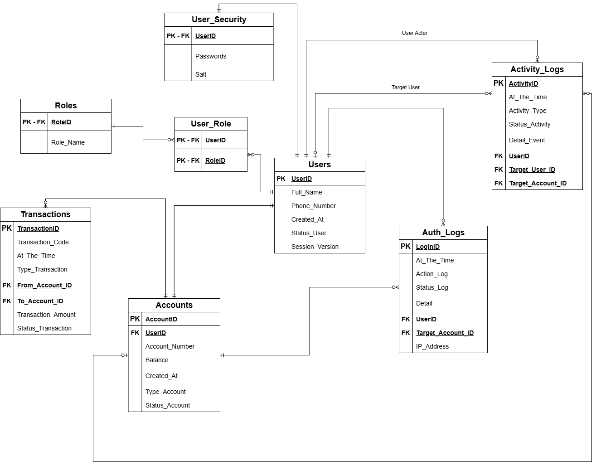

The database is designed around four primary domains:

- Identity Management
- Authentication
- Banking Operations
- Security Telemetry

This separation allows the system to isolate authentication data from user information, support role-based authorization, manage banking operations, and generate structured telemetry for auditing and future security monitoring.

# Identity Management

### Tables

- `Users`   
- `Roles`
- `User_Role`

The Identity Management domain is responsible for maintaining user identities and role assignments.
The `Users` table stores user profile information, the current state of the user on the system, including the current `Session_Version`.

The `Roles` and `User_Role` tables provide role-based authorization capabilities. A user may be assigned one or more roles and will have their role checked at the Interface and will be redirected to the menu, as well as given the permissions to perform actions within that menu, based on their role.

### Design Decision
   
The `Session_Version` in the `Users` table is used as a lightweight session invalidation mechanism. Whenever a sensitive operation occurs, such as changing the password or changing the status of an object, the stored session version will be updated. Through continuous checking before performing any action or refreshing the data, the session version will be checked, and the current user session will be terminated if it is outdated.   

Authorization data is separated from user profile data to simplify permission management and support future role expansion without modifying the core user model.   
The system currently operates with two primary roles:

- `Administrator`
- `User` 

Although users currently hold a single operational role, the authorization model uses a dedicated User_Role relationship table.

This design was chosen to support future RBAC expansion while keeping the current authorization logic simple.

# Authentication Domain

### Tables

- `User_Security`

The Authentication Domain manages credential storage and authentication-related data.

Sensitive information such as password hashes and salts is isolated from user profile information.

This separation supports credential management, authentication validation, and future authentication enhancements.

### Design Decision: 

Instead of storing passwords and authentication-related attributes directly within the `Users` table, the system isolates credential data into a separate domain.

This approach reduces coupling between identity management and authentication logic while improving maintainability and supporting future authentication enhancements.

# Banking Operations Domain

### Tables

- `Accounts`
- `Transactions`

The Banking domain manages account ownership and transaction records.

Each account belongs to a user and stores operational information such as:

- Account Number
- Account Type
- Account Status
- Current Balance
- Account Creation Time

The `Transactions` table records transfers between accounts and provides traceability for financial operations.

Each transaction stores:

- Sender Account
- Receiver Account
- Transaction Amount
- Transaction Type
- Transaction Status
- Transaction Timestamp

### Design Decision

Transaction records are stored separately from account balances and other telemetry logs to preserve historical activity and provide a complete audit record of money transfer operations.

# Security Telemetry Domain

### Tables
- `Auth_Logs`
- `Activity_Logs`

The Security Telemetry domain stores security-relevant events generated by the system.
  
The `Auth_Logs` table records authentication-related events and identity lifecycle activities.

Typical actions include:

- User Registration
- Login
- Logout
- Authentication Failure
- Session Expiration    

Common authentication events include:

```text
USER_CREATED
ACCOUNT_CREATED
LOGIN_SUCCESSFUL
USER_NOT_FOUND
ACCOUNT_NOT_FOUND
WRONG_PASSWORD
SESSION_VERSION_EXPIRED
USER_LOGGED_OUT   
```

The `Activity_Logs` table records administrative and security-related activities such as:

- Password Changes
- User Status Modifications
- Account Status Modifications
   
Example events include:

```text
PASSWORD_CHANGED_SUCCESSFULLY
ACTIVE → LOCKED
ACTIVE → SUSPENDED
LOCKED → ACTIVE
ACCOUNT_STATUS_CHANGED   
```

Unlike operational data, telemetry records are intended to provide visibility into system behavior and user activity.

These records can later be consumed by auditing processes, monitoring systems, or SIEM platforms.

## 3. Operational Flows

This section describes the primary operational workflows implemented by the system.

The objective is not to explain every implementation detail, but to highlight the security behaviors, validation mechanisms, and telemetry generation performed throughout the system lifecycle.   
   
# Login Flow

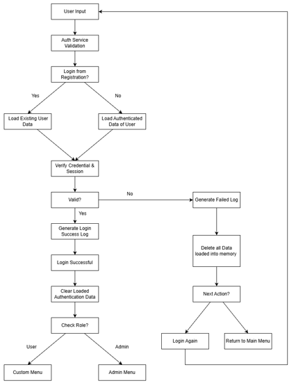

## Purpose

The Login Flow is responsible for authenticating users, validating session-related information, generating authentication telemetry, and routing users to the appropriate interface based on their assigned role.

The flow supports both standard login operations and authentication requests immediately following user registration.


## Security Behaviors

### Authentication Validation

All login requests are validated before authentication is performed.

The system verifies:

- User identity
- Credential validity
- Session-related information

Only validated requests proceed to the authentication stage.
   
---

### Registration-Aware Authentication

The system supports authentication immediately after successful registration.

When the login request originates directly from the registration process, user information already available in memory may be reused instead of performing a full authentication data retrieval operation.

This behavior reduces unnecessary data access while maintaining the same authentication verification process.
   
---

### Credential and Session Verification

Before granting access, the system verifies:

- User credentials
- Authentication data
- Session validity

If verification fails, authentication is denied and a failed authentication event is generated.
   
---

### Authentication Telemetry

Both successful and failed authentication attempts generate records within the `Auth_Logs` table.

Examples include:

- LOGIN_SUCCESSFUL
- USER_NOT_FOUND
- WRONG_PASSWORD
- SESSION_VERSION_EXPIRED

These events provide visibility into authentication activity and account access attempts.
   
---

### Memory Cleanup

Authentication-related data loaded during the login process is removed from memory after the operation completes.

This behavior reduces unnecessary retention of sensitive information and limits the exposure of authentication data beyond its operational lifecycle.
   
---

### Retry Handling

When authentication fails, the user may:

- Attempt authentication again
- Return to the main menu

This behavior allows controlled recovery from authentication failures without exposing additional system information.
   
---

### Role-Based Routing

After successful authentication, the user's assigned role determines which interface becomes available.

The current implementation supports:

- Administrator
- User

Users are redirected to the appropriate menu and granted access only to the operations permitted by their assigned role.   
   
# Transfer Flow

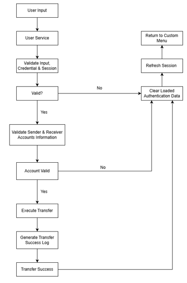

## Purpose

The Transfer Flow is responsible for performing account-to-account transactions while ensuring session validity, account verification, transaction traceability, and telemetry generation.

Only authenticated users with valid information and sessions may perform transfer operations.

## Security Behaviors

### Session Validation

Before processing a transfer request, the system validates:

- User input
- Authentication state
- Session validity

Requests originating from invalid or outdated information and sessions are denied before any transaction processing occurs.
   
--- 

### Account Verification

The system validates both the sender and receiver accounts before executing the transfer.

Verification includes:

- Account existence 
- Account availability
- Account ownership validation
- Operational status checks

Transfers involving invalid accounts are rejected and no transaction is executed.
   
---

### Transaction Execution

After successful validation, the transfer operation is executed and account balances are updated accordingly.

The operation is treated as a business transaction and only proceeds after all validation checks succeed.
   
---

### Transaction Telemetry

Only Successful transfers generate transaction records within the `Transactions` table.

Each transaction record captures:

- Transaction Code
- Sender Account
- Receiver Account
- Transfer Amount
- Transaction Status
- Transaction Timestamp

These records provide transaction traceability and operational auditing capabilities.
   
---

### Authentication Data Cleanup

Authentication-related information loaded during the operation is removed from memory after the transfer process completes.

This behavior reduces unnecessary retention of authentication-sensitive data.
   
---

### Session Refresh

After the operation completes, the system refreshes session-related information.

This process synchronizes the current user state with the latest data stored in the database and allows session invalidation events to be enforced immediately if administrative changes occur during an active session.

The user is then redirected back to the Customer Menu.
   
# Change Password Flow

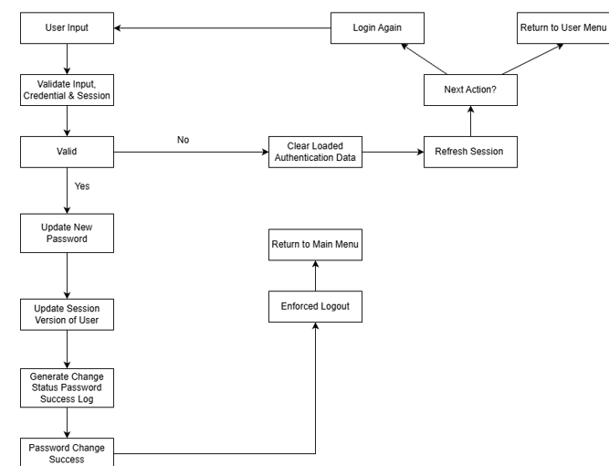

## Purpose

The Change Password Flow is responsible for updating user credentials while ensuring that previously authenticated sessions are invalidated.

This process demonstrates credential rotation, session invalidation, and enforced re-authentication after sensitive account operations.

## Security Behaviors

### Input and Session Validation

Before updating credentials, the system validates:

- User input
- Authentication state
- Session validity

Requests originating from invalid or outdated sessions are denied before any credential changes occur.
   
---

### Credential Rotation

After successful validation, the user's password is updated within the authentication subsystem.

The previous credential is replaced by a newly generated password hash and salt combination.

This process ensures that authentication data remains current and securely managed.
   
---

### Session Invalidation

Following a successful password change, the user's `Session_Version` is updated.

This mechanism invalidates all previously authenticated sessions associated with the account.

Any session holding an outdated version becomes invalid and must be re-authenticated before performing additional actions.
   
---

### Activity Telemetry

Password changes generate records within the `Activity_Logs` table.

Typical events include:

- PASSWORD_CHANGED_SUCCESSFULLY

These records provide an auditable history of credential lifecycle operations.
   
---

### Authentication Data Cleanup

Authentication-related information loaded during the operation is removed from memory after processing completes.

This reduces unnecessary retention of sensitive authentication data.
   
---

### Session Refresh

The system refreshes session-related information after the operation completes.

This ensures that the latest account and session state is synchronized before any further actions are performed.
   
---

### Enforced Logout

After a successful password change, the user is automatically logged out and redirected to the `Main Menu`.

This behavior prevents continued use of sessions established before the credential update and requires the user to authenticate again using the new password.
   
# Change User Status Flow

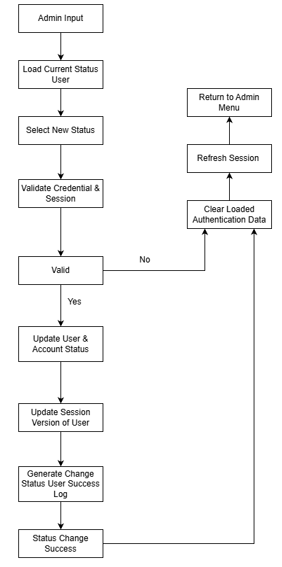

## Purpose

The `Change User Status Flow` allows `Administrators` to modify the operational status of users and their associated accounts.

This process provides administrative control over account accessibility while ensuring that status changes are immediately enforced across active sessions.

## Security Behaviors

### Administrative Validation

Before performing any status modification, the system validates:

- Administrative credentials
- Authentication state
- Session validity

Only authorized administrators with valid sessions may perform status management operations.

---

### Status Management

Administrators may change the operational status of users and their associated accounts.

Examples include:

- ACTIVE
- LOCKED
- SUSPENDED
- CLOSED
Status changes directly affect a user's ability to access protected system functionality.
   
---

### Session Invalidation

Following a successful status modification, the target user's `Session_Version` is updated.

This mechanism invalidates previously authenticated sessions associated with the affected user.

Any active session holding an outdated session version becomes invalid and must be re-authenticated before additional operations can be performed.

---

### Activity Telemetry

Status modifications generate records within the `Activity_Logs` table.

Typical events include:

- ACTIVE → LOCKED
- ACTIVE → SUSPENDED
- LOCKED → ACTIVE

These records provide traceability for administrative actions and support future auditing and security investigations.

---

### Authentication Data Cleanup

Authentication-related information loaded during the operation is removed from memory after processing completes.

This reduces unnecessary retention of sensitive authentication data.

---

### Session Refresh

The system refreshes session-related information after the operation completes.

This ensures that the latest user and account state is synchronized before returning to the administrative interface.

---

### Administrative Enforcement

By combining status updates with session invalidation, the system ensures that administrative decisions take effect immediately rather than waiting for existing sessions to expire naturally.

# Interface Screenshots

This section provides example screenshots of the command-line interface used throughout the system.

The screenshots demonstrate how users and administrators interact with the application after successful authentication.

## Customer Menu

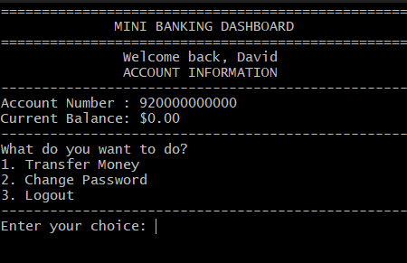

The Customer Menu provides access to user-facing banking functionality, including: Account Management, Money Transfers, and Password Updates.

## Administrator Menu

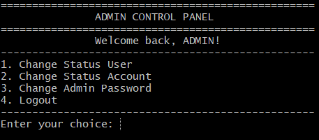

The Administrator Menu provides access to administrative operations such as user Status Management and Account Control functions.

## Transfer Operation

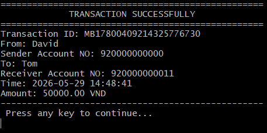

Example transfer operation demonstrating account-to-account transaction processing.

## Password Change Operation

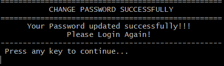

Example password update operation. Successful password changes trigger session invalidation and enforced re-authentication.

## User Status Management

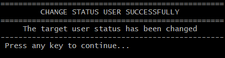

Administrative operation used to modify user status and immediately invalidate existing sessions through the Session Version mechanism.
   
# Example Security Telemetry

The following telemetry records were generated during testing and demonstrate how the system captures authentication activity, transaction operations, and administrative actions.

These records provide evidence that security-relevant events are persistently stored and can later be used for auditing, monitoring, and security analysis.

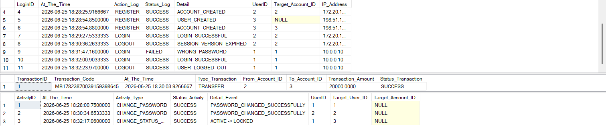

## Authentication Events

Authentication-related events are recorded within the `Auth_Logs` table.

Examples shown in the telemetry output include:

- USER_CREATED
- ACCOUNT_CREATED
- LOGIN_SUCCESSFUL
- USER_NOT_FOUND
- USER_LOGGED_OUT
- SESSION_VERSION_EXPIRED

These events provide visibility into account lifecycle operations, authentication attempts, logout activity, and session validation behavior.

The inclusion of `SESSION_VERSION_EXPIRED` demonstrates the session invalidation mechanism used after sensitive account operations.

## Transaction Events

Transaction-related operations are recorded within the `Transactions` table.

Each transaction record contains:

- Transaction Code
- Sender Account
- Receiver Account
- Transaction Amount
- Transaction Status
- Transaction Timestamp

The example telemetry demonstrates a successful account-to-account transfer operation, providing transaction traceability and operational auditing capabilities.

## Activity Events

Administrative and security-sensitive operations are recorded within the `Activity_Logs` table.

Examples shown in the telemetry output include:

- PASSWORD_CHANGED_SUCCESSFULLY
- ACTIVE → LOCKED

These records provide accountability for administrative actions and maintain an auditable history of security-related operations.

The actor-target logging model allows the system to identify both the user performing the action and the affected user or account.

## Summary

The generated telemetry demonstrates how the system records authentication events, transaction activities, and administrative actions in separate domains.

This separation improves event classification, auditing, and future security analysis while providing a foundation for SIEM-oriented integrations and security monitoring workflows.
   
# Future Security Enhancements

Although the current implementation focuses on a CLI-based banking simulation, several enhancements could further improve scalability, security visibility, and operational realism.

## Docker Deployment

Containerizing the application would simplify deployment, improve environment consistency, and support reproducible testing across different systems.

Potential benefits include:

- Simplified setup and deployment
- Environment isolation
- Easier development and testing workflows


## PostgreSQL Migration

Migrating from SQL Server to PostgreSQL would improve portability and provide exposure to a widely adopted open-source database platform.

Potential benefits include:

- Cross-platform deployment
- Open-source ecosystem integration
- Additional database administration experience


## SIEM Integration

Generated telemetry could be forwarded to a Security Information and Event Management (SIEM) platform for centralized monitoring and analysis.

Potential integrations include:

- Splunk
- Elastic Stack (ELK)
- Microsoft Sentinel

This would allow authentication events, administrative activities, and transaction telemetry to be analyzed from a security operations perspective.


## Detection Rule Simulation

Detection rules could be implemented to identify suspicious behaviors using the generated telemetry.

Example scenarios include:

- Repeated failed login attempts
- Excessive session invalidation events
- Unusual administrative activity
- Suspicious transaction patterns

This enhancement would demonstrate how security telemetry can be transformed into actionable security alerts.

## Telemetry Correlation

Future versions could correlate events across multiple telemetry sources.

Examples include:

- Authentication events linked to administrative actions
- Password changes followed by session invalidation events
- User status changes followed by denied authentication attempts

Telemetry correlation would improve visibility into user behavior and provide a stronger foundation for security investigations.

## Long-Term Vision

The long-term objective is to evolve the project from a banking simulation into a security-oriented laboratory for authentication, authorization, session management, audit logging, telemetry generation, and detection engineering concepts.

Future enhancements will continue to prioritize security visibility, traceability, and operational realism while maintaining a modular and extensible architecture.
