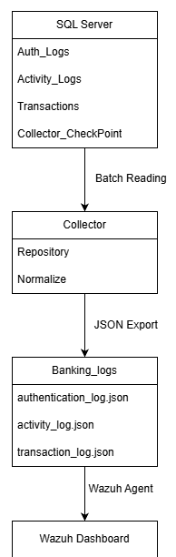
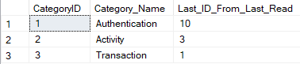
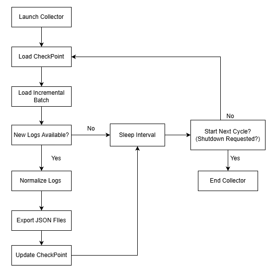
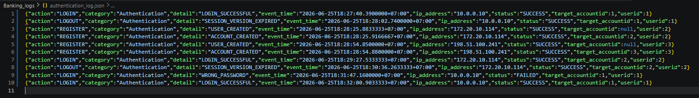
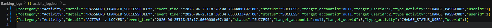
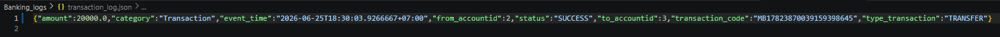
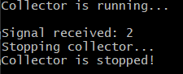

# 📄 Collector Documentation

The Banking Telemetry Collector is a standalone component responsible for bridging the banking application and the SIEM platform.

Instead of allowing the Wazuh Agent to directly query the database, the Collector periodically retrieves newly generated security events from SQL Server, normalizes them into a unified JSON structure, and exports them as telemetry files for Wazuh ingestion.

This document focuses on explaining the Collector component:

- 🏗️ Architecture.
- 🛢️ Checkpoint mechanism.
- 🔄 Collection pipeline.
- 📊 Telemetry generation.

## 1. Architecture Overview

The Collector follows a pipeline-based architecture designed to transform database records into structured telemetry for SIEM ingestion.

Unlike the Application component, which is responsible for generating security events, the Collector continuously retrieves newly created records from SQL Server, converts them into a unified JSON format, and exports them as telemetry files monitored by the Wazuh Agent.

The overall architecture is illustrated below:
   
   
   
---   

### 🗄️ Repository Layer

The Repository Layer communicates directly with SQL Server.

Responsibilities:

- Read Collector checkpoints.
- Load incremental authentication logs.
- Load incremental activity logs.
- Load incremental transaction logs.
- Update checkpoint information after successful export.

The Repository Layer isolates all SQL operations from the remaining Collector logic.
   
---   

### ⚙️ Service Layer

The Service Layer coordinates the entire collection process.

Responsibilities:

- Load checkpoints.
- Request incremental batches.
- Trigger log normalization.
- Export JSON telemetry.
- Update checkpoints.

This layer represents the orchestration center of the Collector.
   
---   

### 📝 Normalization Layer

Before being exported, database records are transformed into a consistent telemetry format.

The current implementation primarily normalizes timestamp values to ensure compatibility with Wazuh's JSON parsing and maintain a uniform event structure across different log categories.

Responsibilities:

- Timestamp normalization.
- JSON field standardization.
- Unified telemetry formatting.

Although the current normalization process is intentionally lightweight, the dedicated Normalization Layer provides a scalable foundation for future enhancements, such as field mapping, data enrichment, event categorization, schema conversion, and cross-source telemetry normalization as the project evolves.
   
---   

### 📂 Telemetry Export

After normalization, events are written into dedicated JSON files.

Generated telemetry includes:

- `authentication_log.json`
- `activity_log.json`
- `transaction_log.json`

These files are continuously monitored by the Wazuh Agent and forwarded to the SIEM platform.
   
---   

### 🛑 Signal Management

The Collector supports graceful shutdown through operating system signals.

Rather than terminating immediately, the Collector completes the current collection cycle before stopping.

This behavior prevents incomplete exports and ensures checkpoint consistency.
   
---   

#### 🧩 Shared Infrastructure

The Collector reuses common infrastructure provided by the Shared module.

Shared responsibilities include:

- Database connection management
- ODBC helper utilities
- File handling
- System logging
- Database error handling

Separating reusable infrastructure into a dedicated Shared component reduces code duplication and keeps the Collector focused on telemetry processing.
   
---   

### 🎯 Architectural Goals

The Collector architecture was designed to demonstrate several telemetry engineering concepts:

Incremental batch collection
Persistent checkpoint management
Log normalization
Structured telemetry generation
SIEM integration
Graceful shutdown

Rather than functioning as a database exporter, the Collector acts as an intermediary telemetry pipeline between SQL Server and the SIEM platform.   

## 2. Checkpoint Design   
   
  
The Collector relies on a dedicated checkpoint table to support incremental telemetry collection.

Unlike the banking application, which manages business entities such as users and accounts, the Collector only maintains synchronization state through the `Collector_CheckPoint` table.
   
| Column | Description |
| ------------ | ------------------------------------|
| `CategoryID` | Unique identifier of each telemetry category. |
| `Category_Name` | Human-readable name of the telemetry category. |
| `Last_ID_From_Last_Read` | Stores the highest successfully exported record ID for the corresponding category. |   

`CategoryID` are defined as follows:   
   
| CategoryID | Telemetry Category |
| ------------ | ------------------------------------|
| `1` | Authentication |
| `2` | Activity |
| `3` | Transaction | 

and with the start value start for each ID is `0`.   

Each telemetry category maintains an independent checkpoint.

Instead of scanning the entire log tables during every polling cycle, the Collector retrieves only records whose primary key is greater than the stored checkpoint.

For example:

- Authentication logs are loaded using the Authentication checkpoint.
- Activity logs are loaded using the Activity checkpoint.
- Transaction logs are loaded using the Transaction checkpoint.

After the exported telemetry has been successfully written to the corresponding JSON file, the checkpoint is updated with the latest processed record ID.

This incremental synchronization mechanism provides several advantages:

- Prevents duplicate telemetry exports.
- Reduces unnecessary database reads.
- Improves collection efficiency.
- Allows the Collector to resume processing after a restart without losing synchronization.
- Design Considerations

The checkpoint is maintained separately for each telemetry category rather than using a single global checkpoint.

This design enables each log source to progress independently, making the collection pipeline more reliable and easier to extend. If additional telemetry categories are introduced in the future, only a new category entry needs to be added to the checkpoint table without modifying the overall synchronization mechanism.   
 
## 3. Collection Pipeline   

The Collector operates as a continuous polling service that periodically synchronizes newly generated security events from SQL Server to the SIEM telemetry pipeline.

Rather than scanning the entire database during every execution, the Collector uses a checkpoint-based incremental strategy to retrieve only records that have not been exported previously.

The overall collection workflow is illustrated below:   
   

Pipeline Stages

The Collector executes the following stages during each collection cycle:

### 1. Load Checkpoint

The Collector begins by loading the latest checkpoint value for each telemetry category.

These checkpoints determine the last successfully exported record and serve as the starting point for the next synchronization cycle.

### 2. Load Incremental Batch

Using the stored checkpoints, the Repository Layer queries SQL Server for records whose identifiers are greater than the current checkpoint.

Only newly generated records are retrieved, avoiding unnecessary database scans.

### 3. Check for New Logs

The Collector verifies whether any new telemetry has been returned.

If no new records are available, the Collector enters the configured sleep interval.
If new records exist, processing continues with the normalization stage.   

### 4. Normalize Logs

Before export, raw database records are transformed into a consistent telemetry format.

The current implementation primarily normalizes timestamp values to ensure compatibility with Wazuh and maintain a uniform JSON structure across different telemetry categories.

The dedicated Normalization Layer also provides a foundation for future enhancements, such as field mapping, metadata enrichment, schema transformation, and cross-source telemetry normalization.

### 5. Export JSON Files

Normalized telemetry is written into dedicated JSON files according to its category.

Generated output includes:

authentication_log.json
activity_log.json
transaction_log.json

These files act as the telemetry source monitored by the Wazuh Agent.

### 6. Update Checkpoint

After a successful export, the Collector updates the checkpoint table with the highest processed record ID for each telemetry category.

This ensures that subsequent collection cycles continue from the correct position without reprocessing previously exported events.

### 7. Sleep Interval

After completing a collection cycle, the Collector waits for the configured polling interval before starting the next synchronization cycle.

This lightweight polling mechanism balances telemetry freshness with database utilization.

### 8. Graceful Shutdown

Before starting a new collection cycle, the Collector checks whether a shutdown signal has been received.

If no signal is detected, the pipeline continues with the next synchronization cycle.

If a shutdown signal is received, the Collector terminates gracefully after completing the previous processing cycle, ensuring that exported telemetry and checkpoint information remain consistent.

Design Characteristics

The collection pipeline is designed around several core principles:

- Incremental batch synchronization.
- Checkpoint-based state management.
- Separation between collection and normalization.
- Category-based telemetry export.
- Continuous polling with configurable intervals.
- Graceful shutdown without data inconsistency.

This design allows the Collector to operate as a lightweight telemetry service while maintaining reliable synchronization between SQL Server and the SIEM platform.   
   
# 4. Generated Telemetry

After normalization, the Collector exports structured telemetry into category-specific JSON files.

Each telemetry category follows a predefined schema that preserves the original security event information while maintaining a consistent format for Wazuh ingestion.

---

## Authentication Telemetry

Authentication telemetry records events related to user authentication and session management.

Each event contains the following information:

- Event category
- Event timestamp
- Authentication action
- Authentication status
- Event detail
- User identifier
- Target account identifier (if applicable)
- Source IP address

Typical events include:

- User registration
- Login
- Logout
- Authentication failures
- Session-related activities

---

## Activity Telemetry

Activity telemetry captures security-sensitive operations performed within the banking system.

Each event includes:

- Event category
- Event timestamp
- Activity type
- Activity status
- Activity detail
- Initiating user identifier
- Target user identifier (optional)
- Target account identifier (optional)

These events primarily describe administrative or user actions that modify the state of the system, providing an audit trail for security monitoring and investigation.

---

## Transaction Telemetry

Transaction telemetry records banking transaction events generated by the application.

Each event includes:

- Event category
- Transaction code
- Event timestamp
- Transaction type
- Source account identifier
- Destination account identifier
- Transaction amount
- Transaction status

These records provide traceability for financial operations and can be used to analyze transaction behavior or simulate security monitoring scenarios.   
   
---   
   
# 5. Runtime Demonstration

The following screenshot demonstrates the Collector during its normal execution lifecycle.

Unlike interactive applications, the Collector operates as a background polling service with minimal console output. The console primarily reports service lifecycle events rather than individual telemetry records.

---

## Collector Console

The Collector follows a simple execution lifecycle:

1. The service starts and initializes the collection pipeline.
2. It continuously polls SQL Server for newly generated telemetry.
3. Newly retrieved records are normalized and exported as JSON files.
4. The corresponding checkpoints are updated after a successful export.
5. The Collector waits for the configured polling interval before repeating the next synchronization cycle.

During normal operation, the Collector remains active until a shutdown signal is received.

When a termination signal is detected, the Collector does not terminate immediately. Instead, it completes the current collection cycle before shutting down gracefully. This behavior ensures that exported telemetry remains complete and checkpoint information stays synchronized with the processed database records.

The console output shown above illustrates the Collector's startup, signal handling, and graceful shutdown sequence.
   
## Summary

The Collector extends the MiniBanking project by introducing a lightweight telemetry pipeline between SQL Server and the SIEM platform.

Through checkpoint-based incremental collection, log normalization, structured JSON generation, and graceful shutdown support, the Collector demonstrates practical concepts commonly found in real-world telemetry engineering and security monitoring systems.